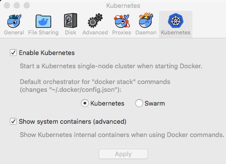
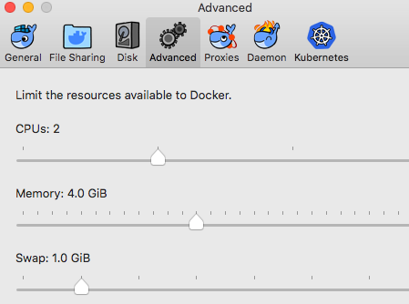
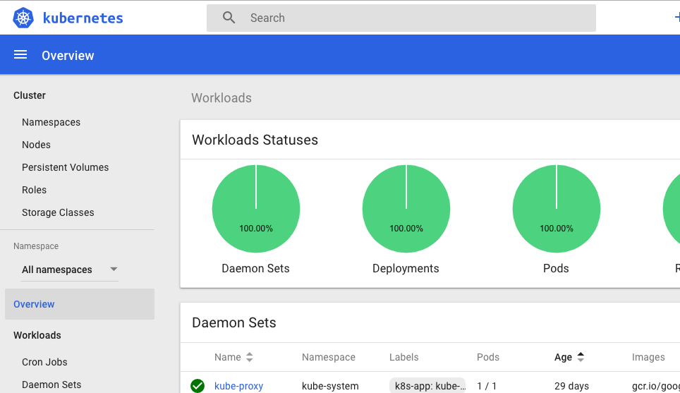
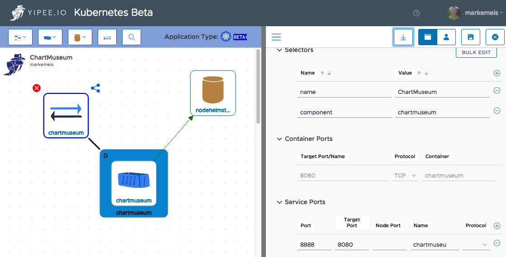

### Brief overview of Draft

<br/>Mark Emeis
<br/>Colorado Springs Docker Meetup
<br/>May 30, 2018
---
### Agenda
1. Docker and Kubernetes - great together 
1. Helm 
   * Why do I need it
   * How to setup
   * Example usage
1.  Draft
   * Why do I need it
   * How to setup
   * Example usage
1. Resources

Note:   Minikube can also be used

---
#### Docker and Kubernetes
* Requires the edge channel 
* Preferences > Kubernetes
   * Enable Kubernetes
   * Show system containers 

+++
#### Docker and Kubernetes
* Preferences > Advanced
   * Allocate additional memory 

+++
##### Notes and Comands
* `docker ps`   _add --format to reduce output_
   * running images
* `kubctl get pods --all-namespaces` 
* `kubectl config get-contexts`
   * ensure you are pointing at the right context
* Pause containers - needed to create _pods_
* Debugging
   * `kubectl cluster-info dump`
   * `docker info`
* --help on CLI commands
+++
#### Kubernetes Dashboard
* run the kubernets dashboard 
`kubectl create -f https://raw.githubusercontent.com/kubernetes/dashboard/master/src/deploy/recommended/kubernetes-dashboard.yaml
`

* Open a proxy server to the cluster `kubectl proxy`

* Hit the dashboard at `http://localhost:8001/api/v1/namespaces/kube-system/services/https:kubernetes-dashboard:/proxy/#!/overview?namespace=default`

+++
#### Kubernetes Dashboard


Notes: More on the dashboard later
---
#### Helm
Package manager for applications.  Think RPM/Homebrew/Apt

Comprised of 3 components
- Helm - the client
- Tiller - the server
- Repo - Repository for _charts_ 

Charts are what you build and deploy.  Charts are comprised of 
- Templates - manifest files for the kubernetes objects
- Values.yaml - A values file

Upon deployment the values files gets combined templates to create your _chart_

+++
#### Tiller 
Server component of helm.  Manages the lifecycle of your _charts_

+++
#### Helm Repos
Simple web server that stores your charts and makes them available for searching and retrieving.  Uses semantic versioning 

Options
* local one
   * `helm serve` 
* Public chart repos on github
* Chart Museum - Open sources repo

+++
#### Chart Museum - in Yipee.io



Note: You can also download as a helm chart - however configuring in Yipee.io is easier.

+++
#### Helm setup 
* Install via brew `brew install kubernetes-helm`
* `helm init`

+++
#### Working with helm
* Add ChartMuseum
* Creating a chart
* Storing in ChartMuseum
* Running and upgrading a chart
Note:
```helm repo add cm http://localhost:31144```
   - ```helm repo list```
   - ```helm package .```
   - ```curl --data-binary "@go-v0.1.0.tgz" http://localhost:31144/api/charts```
   - ```helm search cm\``` - doesn't seem to work
   - ```curl http://localhost:31144/api/charts``` should show the chart
   - to install a helm chart into your cluster
      - ```helm install go --repo http://localhost:31144 --name my-go-example``` odd that we can't use the name of the repo 
   - Change the version in Chart.yaml
   - package and push to the repo
   - ```helm upgrade --repo http://localhost:31144 my-go-example go```
   - ```helm history my-go-example```
   - ```helm rollback my-go-example 1```
   - ```helm delete my-go-example```
---
#### Draft

Note:
Each build creates an image; 
---
#### Resources
* [Docker mac edge channel](https://docs.docker.com/docker-for-mac/edge-release-notes/)
* [Helm](https://helm.sh/)
* [Draft](https://github.com/Azure/draft)
* [Chart Museum](https://github.com/kubernetes-helm/chartmuseum)
* [Public helm charts](https://github.com/kubernetes/charts)
